# Digital Shift Handover Log System and Safety Management Plan

## Overview

Khan-Abhilekh is a coal mine automation system enhancing productivity and safety through digitized logs, real-time monitoring, AI assistance, and automated safety protocols, streamlining operations for efficient decision-making and worker safety

This project aims to address the issue by developing:
1. A **Digital Shift Handover Log System** to streamline and improve the shift transition process.
2. A **Safety Management Plan (SMP)** based on DGMS guidelines for better safety monitoring and hazard management.


## Features

- **Digital Shift Handover Log System:** Replaces manual paper logs to ensure smooth transitions between shifts with comprehensive details on outgoing shift activities.
- **Safety Management Plan (SMP):** Digital implementation of the safety management process based on hazard identification and mitigation, following DGMS guidelines.
- **Automated Reports:** Automatic conversion of shift logs into PDF reports for easy sharing and storage.
- **Real-time Alerts and Notifications:** Supervisors and operators receive critical red flags for upcoming shifts to ensure timely actions.
- **Data Security:** Ensures sensitive information is securely stored and transferred between users and systems.
- **Integration with ERP:** Seamless integration with existing ERP systems for efficient data management.

## Tech Stack

### Frontend
- Vite
- React JS
- Chart.js for data visualization
- Shadcn UI Library
- Material UI
- Tailwind CSS for responsive and modern styling

### Backend
- Express.js as the backend framework
- OpenAI for AI-based functionality (e.g., smart predictions, suggestions)
- PostgreSQL for database management
- Axios for handling API requests
- Puppeteer for automated PDF generation from shift logs

## System Diagrams

### 1. System Architecture Diagram
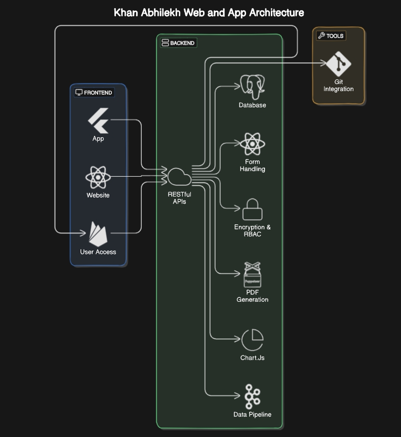

### 2. Detailed User Flow Diagram


## UI Screenshots

### 1. Shift UI

<a src="https://khan-abhilekh-vercel.vercel.app/">Website Frontend</a>
## UI Screenshots

<div style=" justify-content: space-between;">
  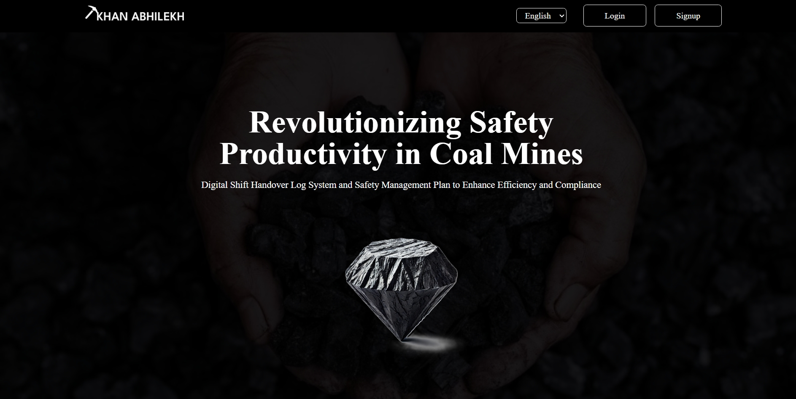
  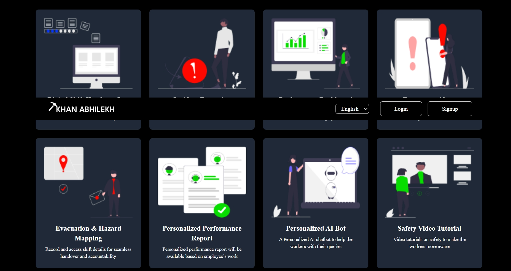
</div>

<div style="justify-content: space-between; margin-top: 20px;">
  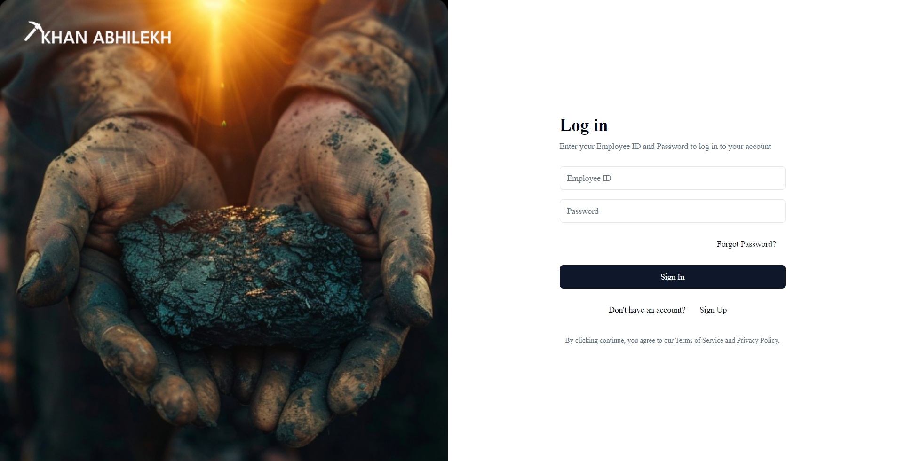
  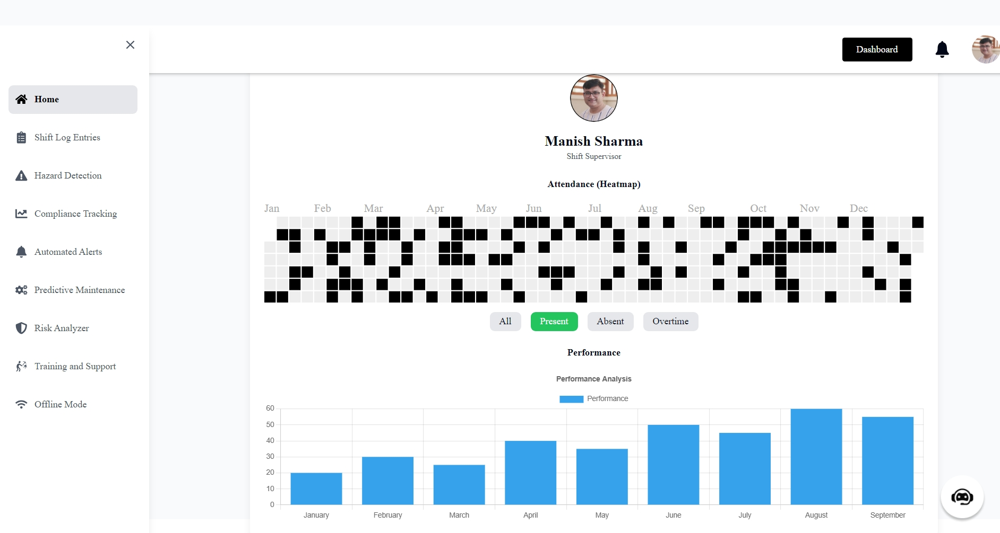
</div>

<div style="justify-content: space-between; margin-top: 20px;">
  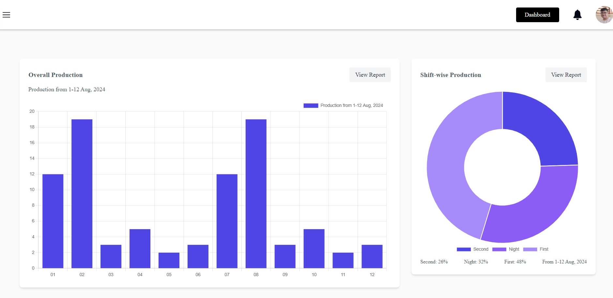
  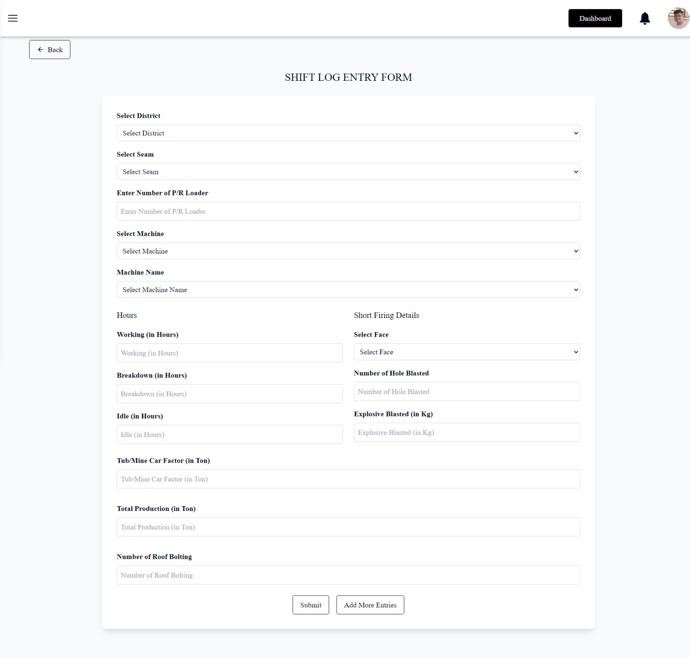
</div>

<!-- ### Additional UI Screenshots -->

<!-- <details> -->
<!-- <summary>Click to expand</summary> -->

<div style=" justify-content: space-between; margin-top: 20px;">
  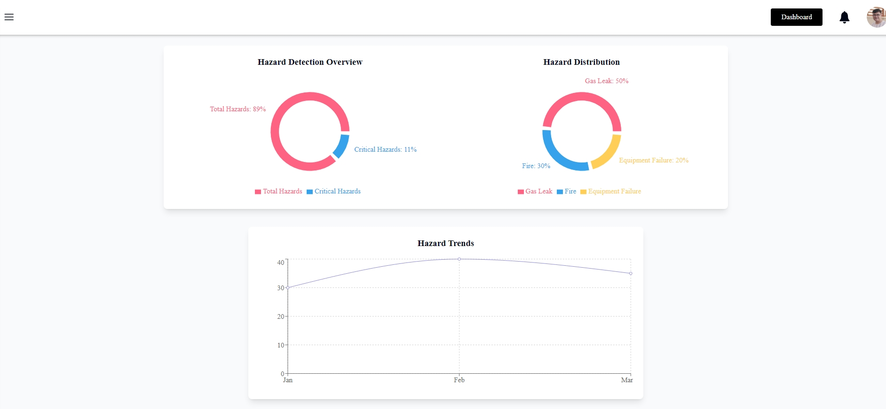
  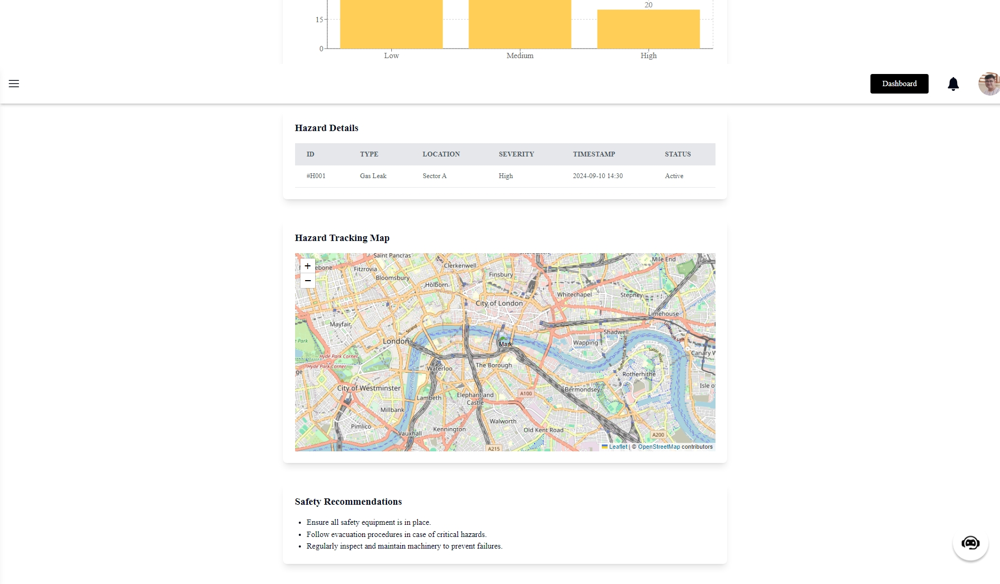
</div>

<div style="justify-content: space-between; margin-top: 20px;">
  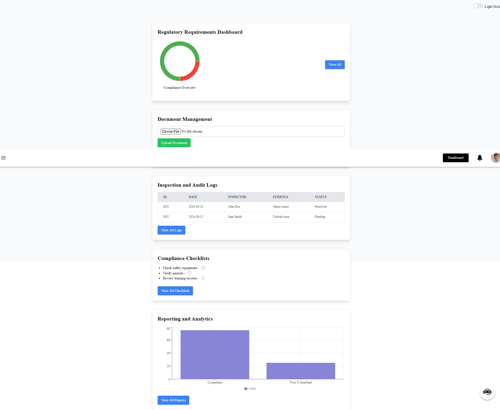
  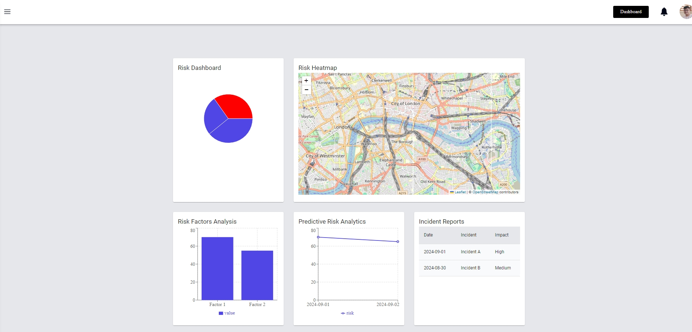
</div>

<div style="justify-content: space-between; margin-top: 20px;">
  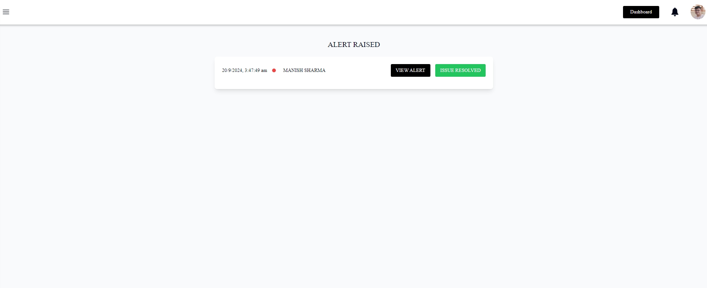
</div>

<!-- </details> -->

## Installation

### Prerequisites

Ensure you have the following installed:

- **Node.js** (v14 or higher) - [Download here](https://nodejs.org/)
- **PostgreSQL** (v12 or higher) - [Download here](https://www.postgresql.org/)
- **Git** - [Download here](https://git-scm.com/)

### Steps

#### 1. Clone the Repository

First, clone the repository to your local machine:

```bash
git clone https://github.com/arpitasen20/khan-abhilekh
cd khan-abhilekh
```

```bash
cd frontend
```

```bash
npm install
```
```bash
npm run dev
```
This setsup and starts the frontend UI of our application

# Set Up Backend Server

```bash
cd server
```
```bash
npm install
```
```bash
node server.js
```
This setups the server on our localhost

It uses keys and data from a .env file that needs to be setup for the working of the project

## Open PostgreSQL and create a new database for the project.
A postgreSQL database have to be created and its id and other informations need to be used to access it on local system.

